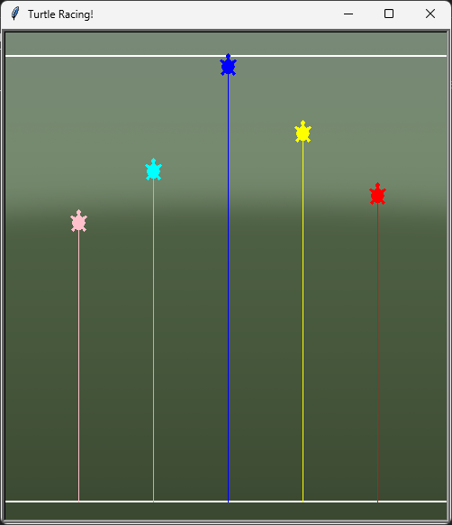
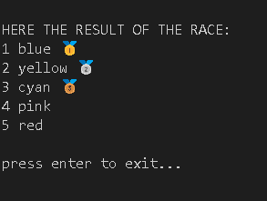

# Turtle Race

A fun turtle race built with Python's `turtle` module. Watch as colorful turtles race to the finish line, and see who wins the gold, silver, and bronze medals!

## Features

- 5 racers with random colors
- Animated race with a finish and start line
- Background image support
- Medal display for top 3 finishers

## How to Run

1. Make sure you have Python installed.
2. Run the following command in your terminal:

   ```sh
   python main.py
   ```

3. Follow the on-screen instructions to start the race.

## Screenshot




Enjoy the race!
